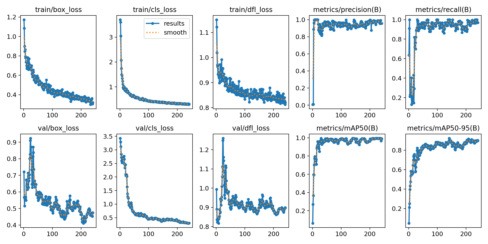
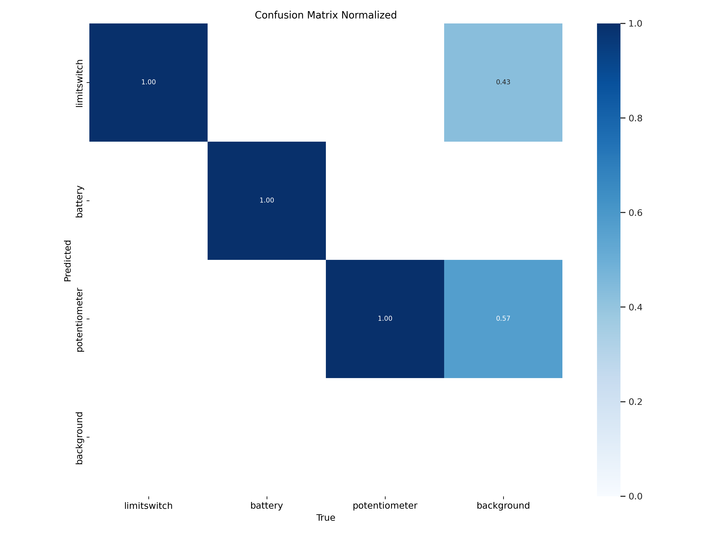
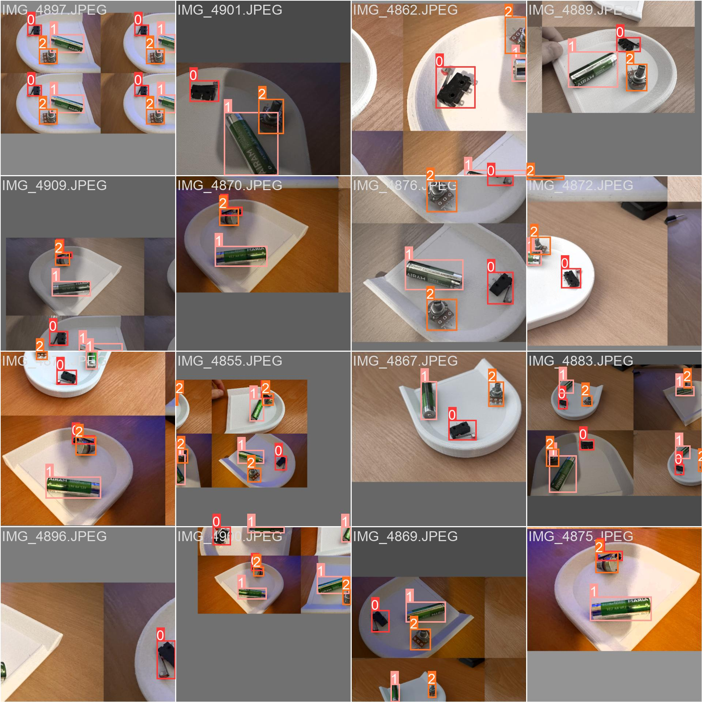
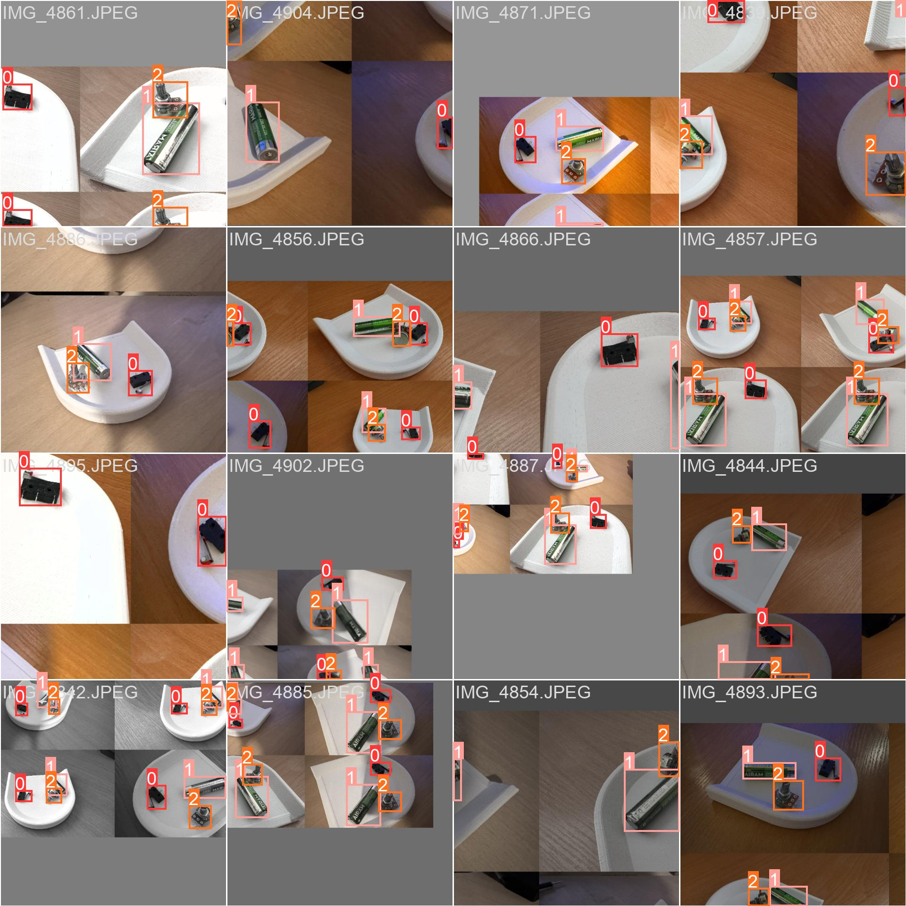
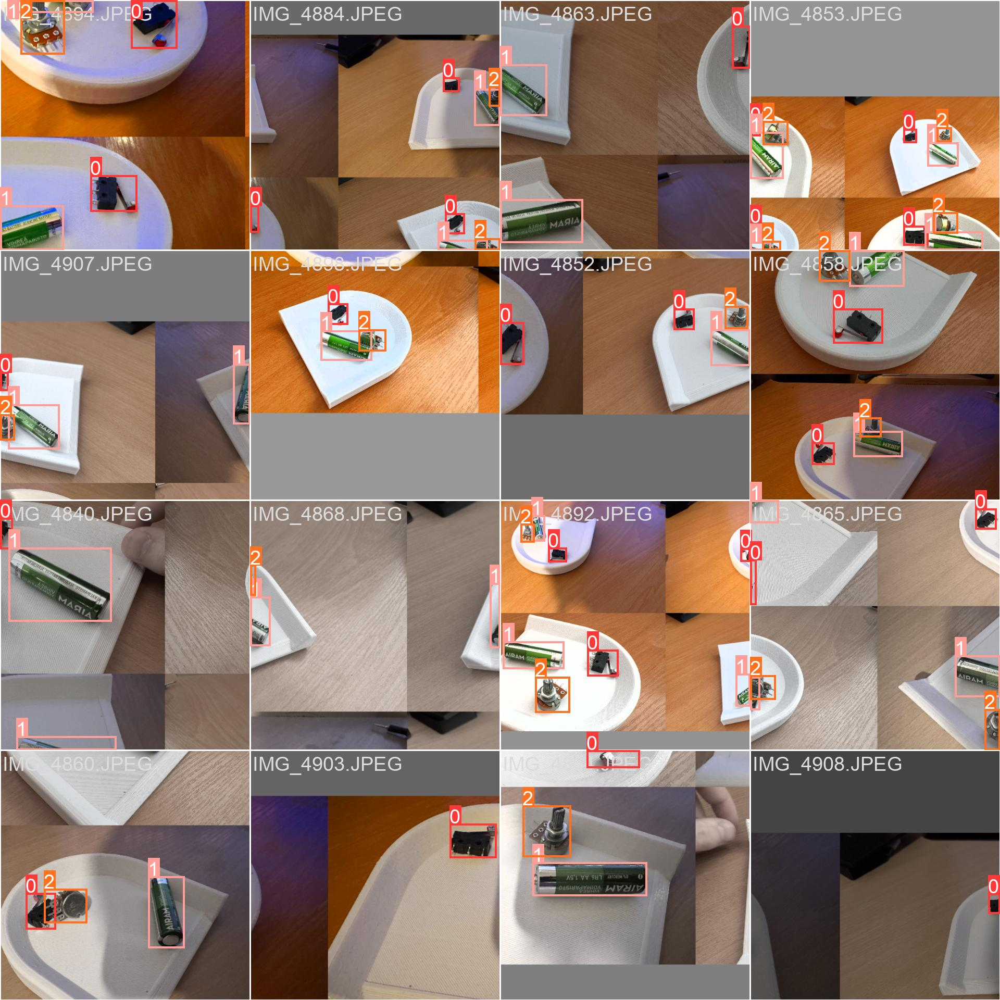
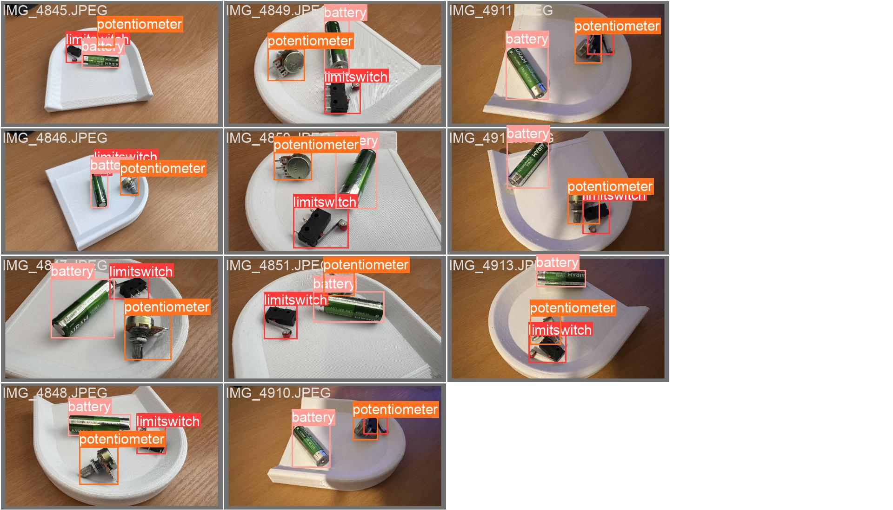
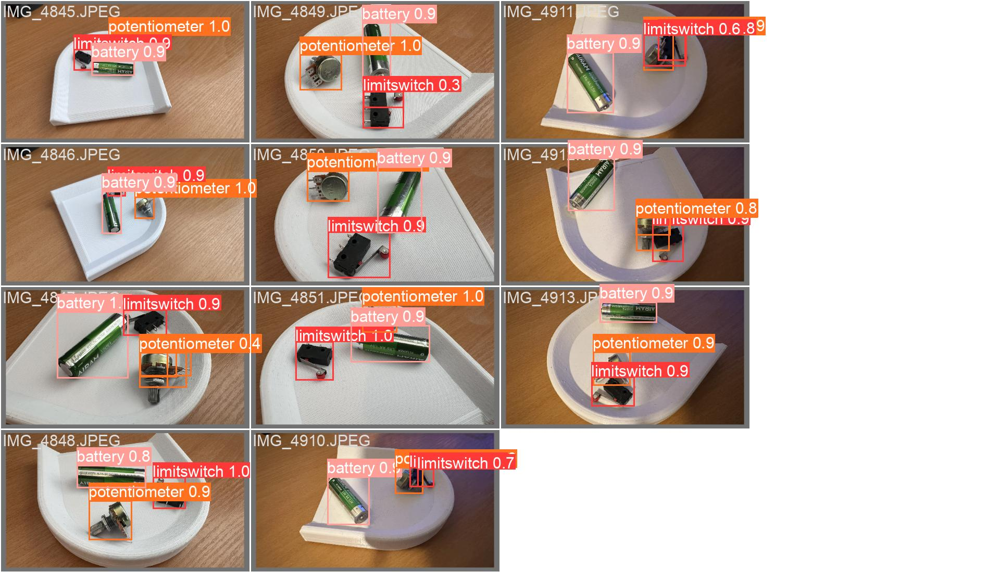

# Thesis AI model and dataset

## Description
The model is a custom YOLOv8 model made with Ultralytics python package. The model is trained on a custom dataset of 3 classes: 'potentiometer', 'limitswitch' and 'battery'. The model is trained on a dataset of 59 images and 59 annotations. The model is trained for 141 epochs. The model is trained on a Tesla T4 GPU.
The model can be found in the [results/weights]('./results/weights/') folder.

## Dataset
The dataset is a custom dataset of 3 classes: 'potentiometer', 'limitswitch' and 'battery'. The dataset is made of 59 images and 59 annotations. The dataset can be found in the [dataset]('./dataset') folder. The dataset is split into 2 folders called 'train' and 'val'. The 'test' folder was not used in this project.

## Statistics
### Model Statistics

### Model Normalized Confusion Matrix

### Model train_batch0

### Model train_batch1

### Model train_batch2

### Model train_batch0

### Model val_batch0_labels
